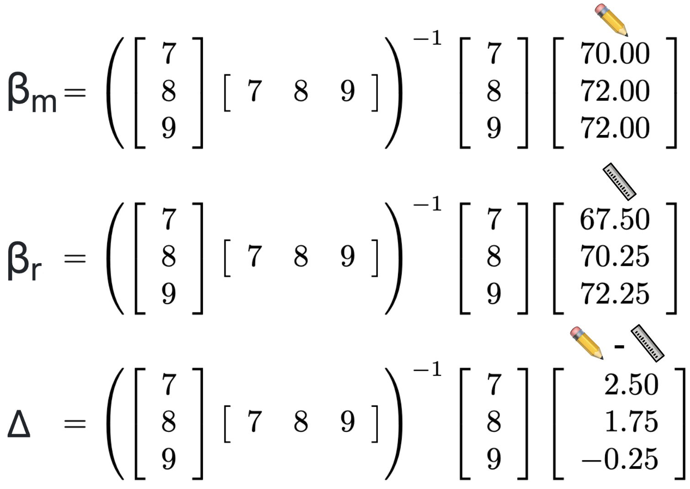
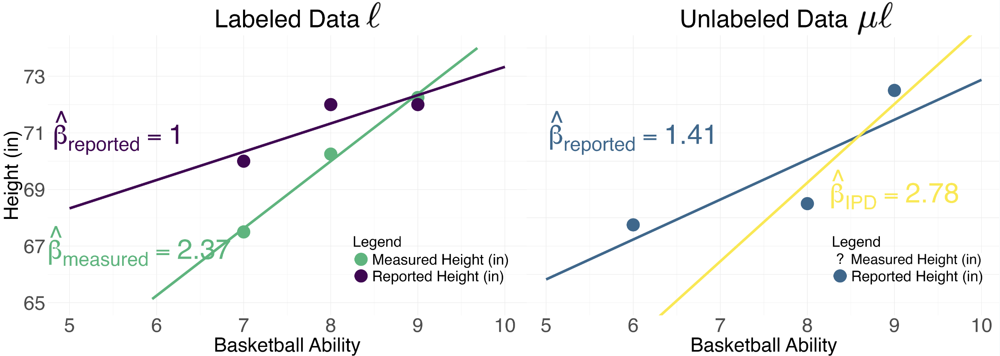
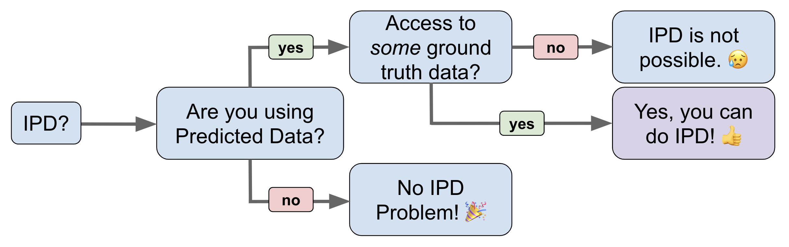

# Inference on Predicted Data (IPD)

The problem: a researcher is interested in studying an outcome, Y, which is difficult to measure due to practical constraints such as time or cost. But they do have access to relatively cheap predictions of Y. They hypothesize that Y is associated with X, a set of features which are easier to measure. Their goal is to estimate a parameter of scientific interest, θ, which describes the relationship between X and Y. How can the researcher attain valid estimates of θ relying upon mostly predicted outcomes of Y?

Regression we want is **Expensive** but **Precise** → **Y = θ₁ X**  
Regression we have is **Cheaper** but **Noisier** → **Ŷ = θ₂ X**  
Importantly, **θ₁** is not the same as **θ₂**!

Rhinoceros analogy from [Hoffman et al. 2024](https://arxiv.org/abs/2401.08702).

## What is "predicted data"?

In machine learning, "predicted data" are often thought of as the outputs from a complicated algorithm. I opt for an even broader definition: **any measure of a conceptual variable where a better, more direct measure exists.** This definition includes predictions from black-box AI models like chatGPT, but also includes other data we rely upon as social scientists, like survey responses, interviews, imputations, statistical estimates, derived measures, and a whole host of other proxies. Below is a table with some examples I have come across in my own research.

Every conceptual variable comes with different measurement challenges, but in general, more precise measurements are also more expensive to collect. A stylized image below shows that **expensive and precise** ground truth measures tend to live in the light blue region, with predicted data everywhere else. Because of this cost-quality tradeoff, we often resort to working with predicted data in practice. But not all predicted data are created equally! The best are those depicted in the green region - relatively **precise and cheap** compared to the red region - **noisy and expensive**.

## Measurements vary in both cost and precision

| Variable | Ground Truth | Predicted |
|----------|-------------|-----------|
| Cause of Death | Vital Registration | Verbal Autopsy |
| Obesity | Fat Percentage | BMI |
| Income | Admin Data | Self Reported |
| Environmental Attitude | Questionnaire | NLP Sentiment |

## What does it mean for inference on predicted data to be *invalid*?

In this context, valid statistical inference refers to both **un-biased point estimates** and **precise uncertainty bounds**. Relative to inference performed with "ground truth" outcomes, inference on predicted data may have biased point estimates due to systematic differences between predictions and the ground truth, and the reported uncertainty will be deceivingly narrow because it doesn't account for any of the prediction error.

Why does this matter? Consider a very simple hypothesis test where the p-value tells us whether or not an observed relationship between X and y is statistically significant. This conclusion is a function of both the point estimate and the uncertainty around that point estimate. The stylized diagram below demonstrates how bias and conservative uncertainty might lead to very different scientific conclusions.

## Inference can have bias and/or misleading uncertainty

## So how *do* you perform valid inference on predicted data?

There are several existing methods for performing the bias correction for valid inference with predicted data. While the technical details differ, these methods are built upon the same intuition. At its simplest, you incorporate what you learn when you have access to both ground truth and predicted outcomes into downstream inference where you rely solely on predicted outcomes. The two step procedure looks like this:

1. Using side-by-side ground truth and predicted measures of the outcome variable, estimate the **IPD rectifier, Δ**. This tells you how differences between Y and Ŷ are associated with covariates X for the same observation.
   
   (Yᵢ - Ŷᵢ) = ΔXᵢ

2. Now, when you perform inference with predicted outcomes in the absence of ground truth measured outcomes, you incorporate the rectifier Δ into the naive parameters you estimate to recover valid IPD estimates.
   
   Invalid IPD → Ŷ₂ = θX₂  
   Correct IPD → Ŷ₂ = (θ+Δ)X₂

## Cartoon example: height and basketball ability

We are interested in the association between a person's height and an index of their basketball ability on a scale from 1-10. Height can be measured directly, or from a self-report. Some people might report correctly, others might not, so we consider the self-reported height **predicted** data relative to directly measured height as **ground truth** data.

Oops! It looks like some people report being a couple inches taller than they actually are... How does this affect our conclusion about the association between height and basketball ability when we are relying on mostly self-reported height outcomes? Let's see. This is what it looks like to learn the **rectifier Δ** from the labeled data to correct inference performed on the unlabeled data.

First, we have some labeled data, *ℓ*, with observed basketball ability 🏀, with both measured height 📏 and self-reported height ✏️. We also have some unlabeled data, *μℓ*, with observed basketball ability 🏀 and only self-reported height ✏️.

For the labeled data *ℓ*, we can specify the relationship, β, between height {measured:📏:yₘ} or {reported:✏️:yᵣ} and basketball ability {🏀:Xₗ} with the following equations:

y📏 = β📏 🏀ₗ or yₘ = βₘXₗ  
y✏️ = β✏️🏀ₗ or yᵣ = βᵣXₗ

solution for βₘ written as βₘ = (XₗᵀXₗ)⁻¹Xₗᵀyₘ  
solution for βᵣ written as βᵣ = (XₗᵀXₗ)⁻¹Xₗᵀyᵣ

and residuals of reported height y✏️ and measured height y📏

After matrix multiplication, rectifier Δ works out to **-1.375**. To recover the IPD corrected estimate βᵢₚᴅ from the unlabeled data *μℓ*, we first estimate βᵣ from yᵣ = βᵣXμℓ just like above. We find that *μℓ* βᵣ is **1.41**. Then, we subtract the rectifier Δ from βᵣ to find βᵢₚᴅ. This gives

βᵢₚᴅ = βᵣ - Δ  
1.41 - (-1.375) = 2.78  
**βᵢₚᴅ = 2.78**

Below, you can see how the estimated relationships (*ℓ* βᵣ, *ℓ* βₘ, *μℓ* βᵣ, *μℓ* βᵢₚᴅ) compare to eachother. In the labeled data *ℓ*, we see that the ground truth relationship between basketball ability and directly measured height is βₘ=2.37. Because some people self-reported being taller than they actually are, the estimated relationship is much weaker, with βᵣ=1. Moving to the unlabeled data *μℓ*, we see that the naive estimate of the relationship between self-reported height and basketball ability is similarly weak, with βᵣ = 1.41.

Leveraging the relationship between directly measured height 📏 and self-reported height ✏️ in the labeled dataset *ℓ* enables us to produce a valid estimate βᵢₚᴅ in the unlabeled dataset *μℓ*. βᵢₚᴅ = 2.78 is much closer to the ground truth βₘ=2.37, and we arrive at this conclusion even in the absense of ground truth measures in the unlabeled dataset *μℓ*. The magnitude of the ground truth relationship between height and basketball ability is much larger than we would conclude from inference on predicted data. For more discussion about how IPD correction can alter your scientific conclusions, check out [Section 4.3](https://openreview.net/forum?id=QbCHlIqbDJ#discussion) from my 2024 paper *From Narratives to Numbers: Valid Inference Using Language Model Predictions from Verbal Autopsies*.

## How to determine if IPD correction makes sense for your problem:

## IPD References
(in reverse order of publication date)

1. Methods for correcting inference based on outcomes predicted by machine learning. **(PostPI)**  
   *Wang, McCormick and Leek.* 2020 [PNAS](https://www.pnas.org/doi/suppl/10.1073/pnas.2001238117).

2. Prediction-powered inference. **(PPI)**  
   *Angelopoulos, Bates, Fannjiang, Jordan and Zrnic.* 2023a [Science](https://www.science.org/doi/10.1126/science.adi6000).

3. PPI++: Efficient Prediction-Powered Inference. **(PPI++)**  
   *Angelopoulos, Duchi and Zrnic.* 2023b [arxiv](https://arxiv.org/abs/2311.01453).

4. Assumption-Lean and Data-Adaptive Post-Prediction Inference. **(PSPA)**  
   *Miao, Miao, Wu, Zhao and Lu.* 2023 [arxiv](https://arxiv.org/abs/2311.14220).

5. Do We Really Even Need Data? 🦏  
   *Hoffman, Salerno, Afiaz, Leek and McCormick.* 2024 [arxiv](https://arxiv.org/abs/2401.08702).

6. From Narratives to Numbers: Valid Inference Using Language Model Predictions from Verbal Autopsies **(multiPPI++)**  
   *Fan, Visokay, Hoffman, Salerno, Liu, Leek and McCormick.* 2024 [COLM](https://openreview.net/forum?id=QbCHlIqbDJ#discussion).

7. Code respository for the `ipd` package can be found [here](https://github.com/ipd-tools/ipd).